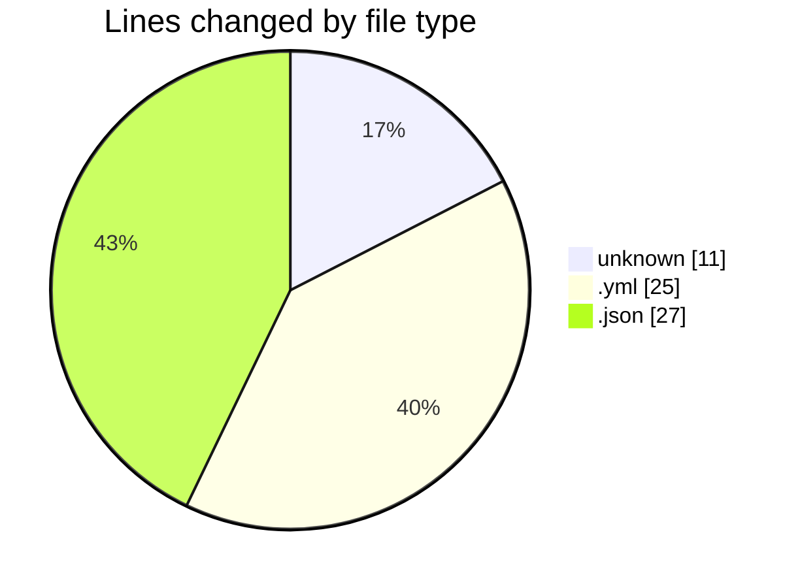
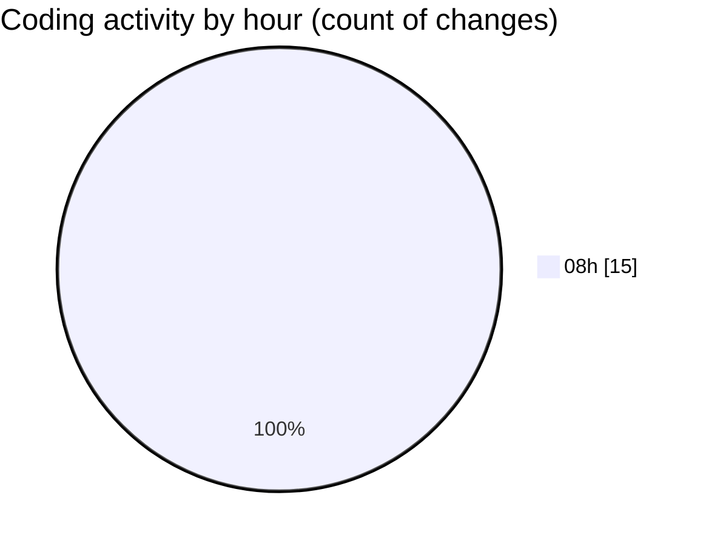

# scripts (Workspace) - Activity Summary 

## Overall Statistics

| Stat                   | Value                                                             |
| ---------------------- | ----------------------------------------------------------------- |
| **Lines Added** (➕)   | 58                                          |
| **Lines Removed** (➖) | 5                                        |
| **Net Change** (↕)    | 53                |
| **Active Time** (⌚)   | 19 minutes |

## Modified Files
- **.env** (+1, -0)
- **docker-compose.yml** (+25, -0)
- **settings.json** (+1, -1)
- **cline_mcp_settings.json** (+21, -4)
- **Dockerfile** (+10, -0)

## Visualizations

### By File Type (Lines Changed)

### By Hour (Estimated Activity Count)

> **Last Updated:** 5/9/2025, 8:36:38 AM