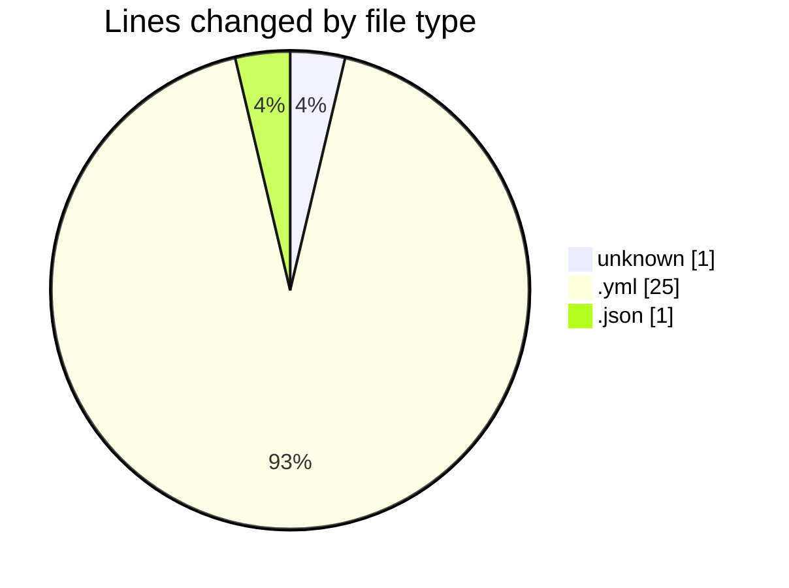
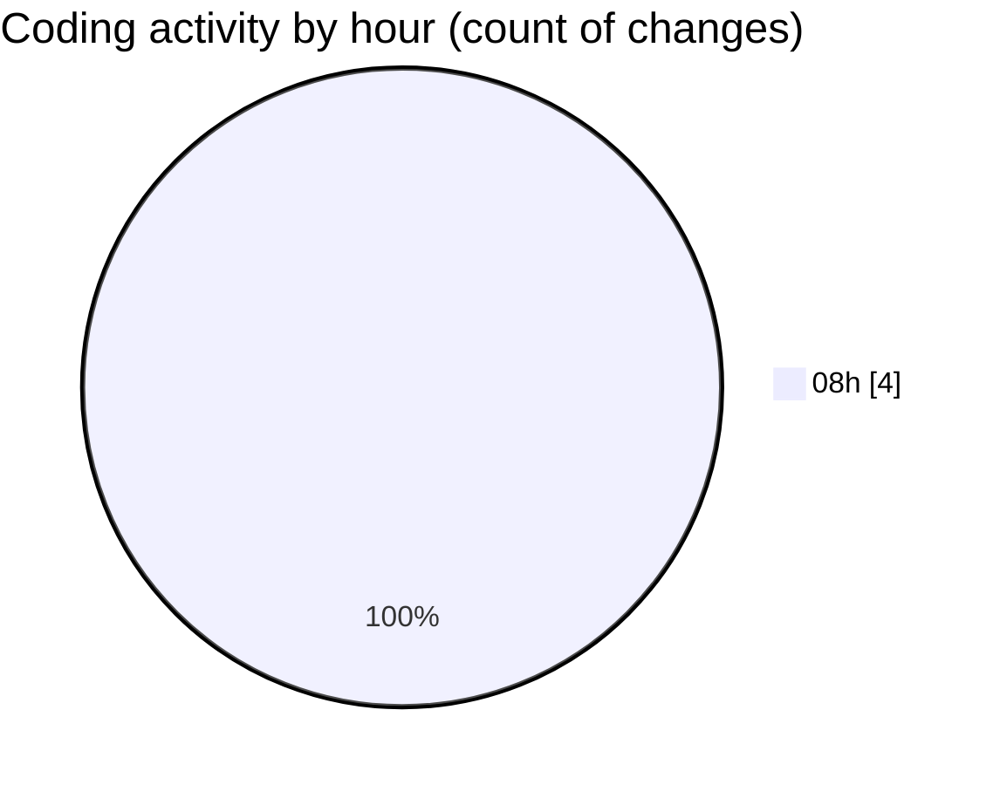

# scripts (Workspace) - Activity Summary 

## Overall Statistics

| Stat                   | Value                                                             |
| ---------------------- | ----------------------------------------------------------------- |
| **Lines Added** (➕)   | 26                                          |
| **Lines Removed** (➖) | 1                                        |
| **Net Change** (↕)    | 25                |
| **Active Time** (⌚)   | 5 minutes |

## Modified Files
- **.env** (+1, -0)
- **docker-compose.yml** (+25, -0)
- **settings.json** (+0, -1)

## Visualizations

### By File Type (Lines Changed)

### By Hour (Estimated Activity Count)

> **Last Updated:** 5/9/2025, 8:21:38 AM